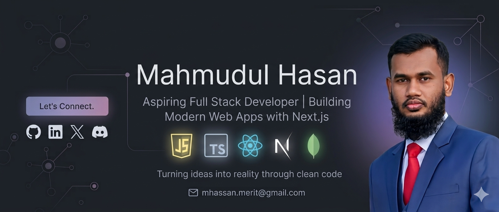

<!-- ==================== BANNER ==================== -->

  

<h1 align="center">Hi 👋, I'm Mahmudul Hasan</h1>

<h3 align="center">
  Frontend Developer | React & Next.js Learner
</h3>

  
  
  

---

## 👨‍💻 About Me

I'm a passionate web development learner focused on building modern, responsive, and user-friendly web applications.

Currently, I'm developing my skills in React, Next.js, TypeScript, and backend technologies while working on real-world projects.

📍 **Location:** `Gazipur, Dhaka, Bangladesh`
📧 **Email:** `mhassan.merit@gmail.com`

---

## 🚀 Current Activities

* 🔭 I’m currently exploring **Next.js**
* 🌱 I’m learning **TypeScript and Full-Stack Web Development**
* 💻 I’m building projects with **React and Next.js**
* 🛠️ I’m improving my **Backend Development** skills
* 📚 I’m practicing by building real-world web applications
* 🎯 My goal is to become a professional **Full-Stack Developer**

---

## 🛠️ Skills & Technologies

### Frontend

  

### Backend & Database

  

### Tools

  

---

## 📂 Featured Projects

### 🏋️ Workout Library

A responsive workout library web application where users can explore different workouts and exercises.

**Technologies:** Next.js, React, TypeScript, Tailwind CSS, DaisyUI, React Toastify

🔗 **Live Demo:** https://fit-log-amber-eight.vercel.app/
🔗 **Repository:** https://github.com/mhasan1224/fit-log

---

### 🧑‍💻 DevStack

A responsive developer resource platform designed to showcase useful development tools, technologies, and resources in a clean and user-friendly interface.

**Technologies:** React, TypeScript, Tailwind CSS, DaisyUI, React Toastify

🔗 **Live Demo:** https://gentle-concha-f8e9c6.netlify.app/
🔗 **Repository:** https://github.com/mhasan1224/B14-A05-DevStack

---

## 📊 GitHub Statistics

  

---

## 🤝 Connect With Me

---

  <b>⚡ Always Learning • Always Building • Always Improving</b>

  Thanks for visiting my profile! 😊

